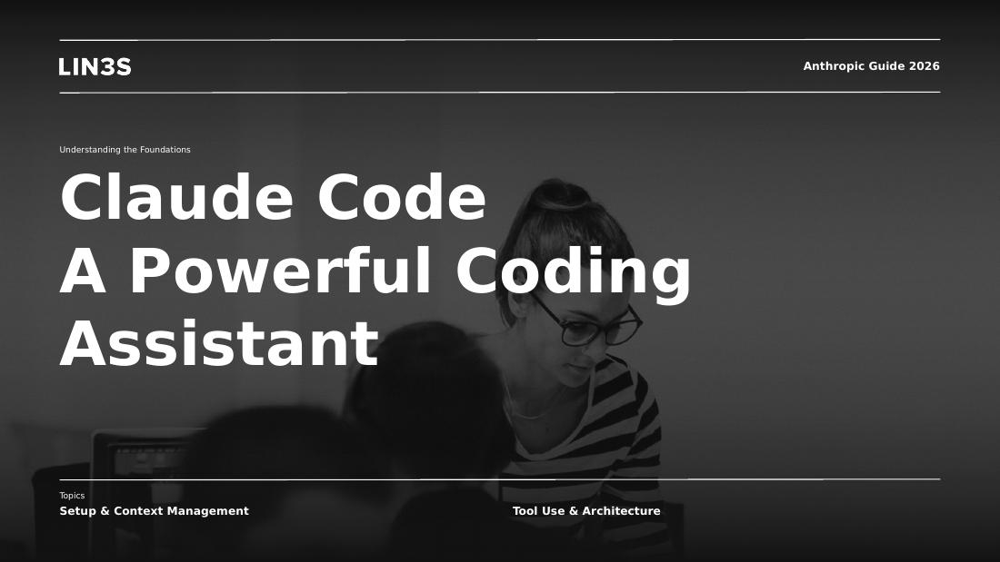
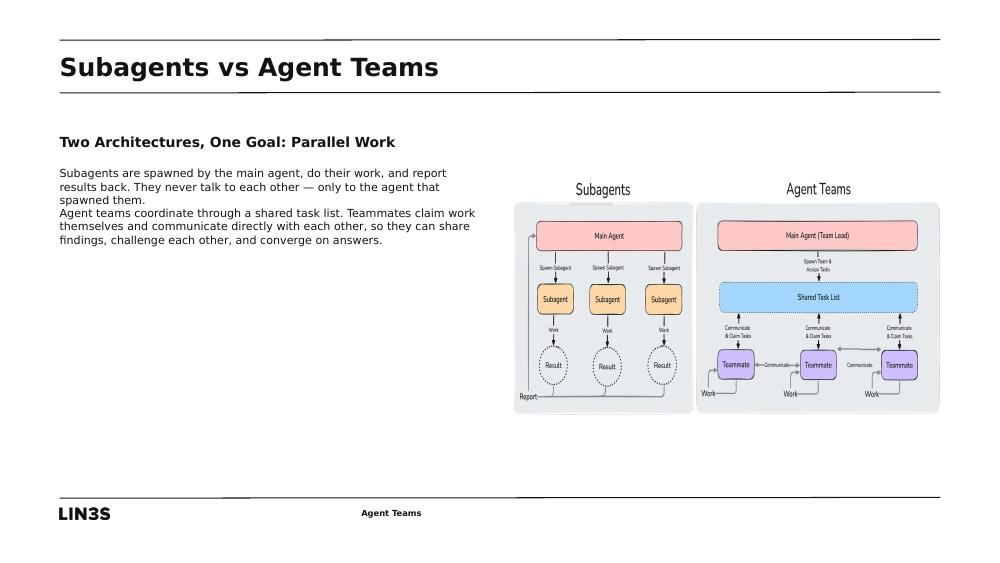
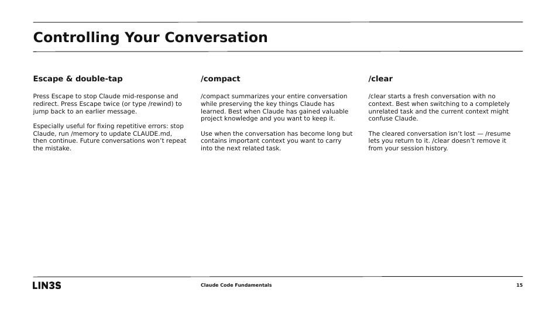
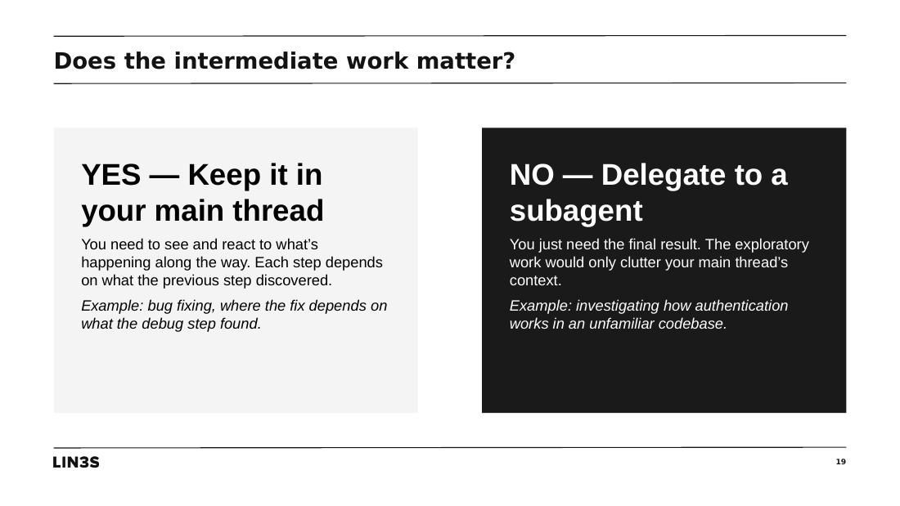
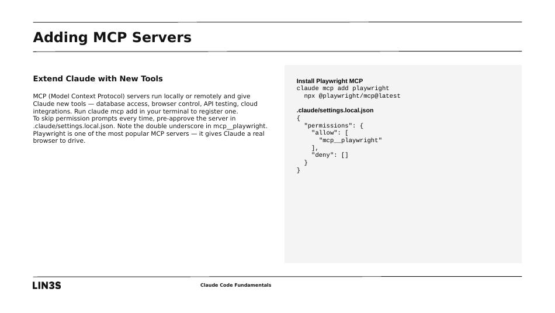

# LIN3S Presentations Hero

> A Claude Skill that turns Word documents into polished PowerPoint presentations using the LIN3S Design Week 2020 template.

---

## Para el equipo de LIN3S

Hola. Soy profesor universitario en España y enseño marketing apoyándome en herramientas de IA. Este proyecto es una herramienta educativa de código abierto, construida sobre la plantilla **LIN3S Design Week 2020**, que automatiza la creación de presentaciones académicas a partir de documentos.

Antes de distribuir esto públicamente, **quiero pedir vuestro permiso para incluir la plantilla** dentro de este repositorio. La plantilla es una pieza de diseño que vosotros creasteis, y aunque mi uso es estrictamente educativo y sin ánimo de lucro, redistribuirla sin vuestra autorización no me parece correcto.

Os pido que veáis lo que se ha construido sobre vuestra plantilla y, si os parece bien, que me concedáis permiso para incluirla aquí con atribución completa. Si preferís que no se incluya, retiraré la plantilla del repositorio inmediatamente y los usuarios la proporcionarán por su cuenta.

Si tenéis cualquier duda o sugerencia, podéis abrir un issue en este repositorio o contactarme directamente. *Gracias.*

---

## What this project is

**LIN3S Presentations Hero** is a [Claude Skill](https://www.anthropic.com/news/claude-skills) — a reusable knowledge-plus-tooling bundle that gives Anthropic's Claude AI the ability to build professional slide decks from source documents. The skill encodes everything needed to read a `.docx` or `.pdf`, plan a slide structure, edit the LIN3S template at the XML level, swap in source-document images, and produce a finished `.pptx` ready for PowerPoint or Google Slides.

It was developed iteratively while building four educational decks on Anthropic's Claude Code product. Those four decks (included in `examples/`) are real-world proof points: every line of the skill's workflow, every helper function, and every pitfall documented in the references was discovered during their construction.

### Built using your template

All four example decks are built directly on `LIN3S_TEMPLATE.pptx`. The skill preserves the template's distinctive design system:

- The dark portrait title slide with topic callouts
- The agenda layout with numbered grid
- Section dividers with image-left + dark-right panels and `NN ― TT` indicators
- Three-column body layouts with bold headers
- The clean serif-and-sans typography pairing
- The LIN3S wordmark in the footer of every slide

The LIN3S branding is intentionally preserved across all output. Decks built with this skill carry your visual identity into university classrooms and educational repositories.

## What it produces

Three representative slides from the four example decks:

**Title slide** — the template's dark portrait layout with section topics



**Section divider** — `NN ― TT` indicator and section title on the dark right panel


**Image + text layout** — picture placeholder with supporting prose



**Three-column comparison** — bold headers per column, used for comparing options or steps



**Decision cards** — light/dark contrast cards on a quote slide



**Code block on right** — Courier-styled code panel paired with explanatory text



Full `.pptx` files are in [`examples/`](examples/).

## What's in this repository

```
lin3s-presentations-hero/
├── README.md                          # this file
├── LICENSE                            # MIT
├── CHANGELOG.md
├── skill/                             # the Claude Skill itself
│   ├── SKILL.md                       # workflow blueprint Claude follows
│   ├── assets/
│   │   └── LIN3S_TEMPLATE.pptx       # the LIN3S template (used by permission)
│   ├── scripts/
│   │   ├── pre_fixes.py              # layout pre-fixes
│   │   ├── helpers.py                # reusable XML edit functions
│   │   └── verify.py                 # placeholder leftover scanner
│   └── references/
│       ├── slide_taxonomy.md         # source-slide → content-type mapping
│       ├── patterns.md               # 10 reusable layout patterns
│       ├── pitfalls.md               # known gotchas with fixes
│       └── pdf_source.md             # handling PDF inputs
├── examples/                          # four educational decks built with this skill
│   ├── 01_Claude_Code_Presentation.pptx
│   ├── 02_Introduction_to_Subagents.pptx
│   ├── 03_Agent_Teams.pptx
│   └── 04_Claude_Code_Fundamentals.pptx
├── docs/
│   ├── installation.md               # how end users install the skill
│   └── screenshots/                  # the images shown above
└── scripts/
    └── build.sh                      # reproducible packaging
```

## Installation

For end users wanting to install the skill into their Claude environment, see [`docs/installation.md`](docs/installation.md).

In short: download the latest `.skill` file from the [Releases](../../releases) page, then add it to Claude's skills directory. The skill auto-triggers whenever someone asks Claude to turn a document into slides.

## How the skill works

The skill follows a nine-step workflow encoded in `skill/SKILL.md`:

1. **Read the source document** — extract text and inspect embedded images
2. **Plan the slide structure** — 18–25 slides typical, organized around source sections
3. **Unpack and apply pre-fixes** — open the LIN3S template, fix two known visual issues
4. **Duplicate template slides** — one duplicate per planned slide using each source layout
5. **Rebuild the slide order** — update `presentation.xml` with the planned sequence
6. **Copy source images** — move docx images into the template's media folder
7. **Edit slides in a batched Python script** — using reusable helpers
8. **Clean, pack, render, QA** — package the `.pptx` and visually verify
9. **Deliver** — copy to outputs and notify the user

The reusable helpers handle the most common edit patterns: 3-column comparisons, image+text slides, code blocks on the right side, problem/solution cards, and full-width text layouts. Each helper is built around the exact placeholder strings that appear in your template — meaning the skill won't generalize to other templates without modification, but produces clean, consistent output on this one.

## Attribution and license

The skill code itself is **MIT licensed** (see [`LICENSE`](LICENSE)). You're free to use, modify, and redistribute it.

The **LIN3S Design Week 2020 template** bundled in `skill/assets/` is the design property of LIN3S. It is included in this repository **pending confirmation of permission from LIN3S** for educational redistribution. If LIN3S declines or requests removal, the template will be removed from the repository and end users will need to provide their own.

The LIN3S brand mark (the "LIN3S" wordmark in the footer of every slide) is preserved by default in all decks built with this skill, as a form of in-deck attribution.

## A note on what this is and isn't

This skill is intentionally narrow. It builds decks on **one specific template** — yours. It doesn't try to be a general-purpose presentation builder. Other organizations wanting similar functionality on their own templates would clone this repo as a starting point and substitute their own template, helper functions, and references.

The skill was built for an educational context (university marketing instruction with Claude Code as a teaching subject). Its design decisions reflect that origin: it's optimized for clarity and consistency over visual variation, and it favors prose over heavy formatting. Decks built with it look like **your template** doing the educational work it was made for.

## Roadmap

If LIN3S grants permission to redistribute the template, planned next steps include:

- Documentation translated to Spanish
- Example decks in additional subject areas (not just Claude Code)
- Support for additional LIN3S templates if you share more
- A short video walkthrough showing the skill in action

## Contact and contributing

Issues and pull requests welcome. For the LIN3S team specifically: please open an issue tagged `lin3s-feedback` with any concerns about the template's inclusion or use.
